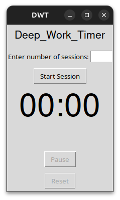
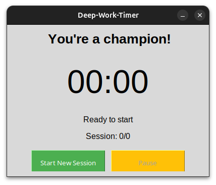

# Deep Work Timer (DWT)

A simple, customizable deep-work timer app inspired by the Pomodoro technique — built with Python and Tkinter.

## 🌟 Project Overview
This is my first project, and I'm excited to share it! The Deep Work Timer app helps you structure focused work sessions with dedicated break times. You can:
- Set the number of sessions you want to complete.
- Customize your work and break durations.
- Stay focused and track your progress visually.

I’ve built two versions so far:

### ✅ **Version 1:**
- Enter the number of sessions you want to complete.
- Fixed work time (25 minutes) and break time (5 minutes).
- Basic GUI for starting, pausing, and resetting.

### ✅ **Version 2:**
- Full customization: choose your work duration, break duration, and number of sessions.
- Updated and cleaner GUI.
- Motivational text display and session tracking.
- Bigger, more aesthetic buttons and labels.

## 📸 Screenshots
| Version 1                                  | Version 2                                  |
|--------------------------------------------|--------------------------------------------|
|  |  |

## 🚀 How to Run
1. Clone the repository:
```
git clone https://github.com/sayak-majumder/deepwork-timer.git
```
2. Navigate to the project folder:
```
cd deepwork-timer
```
3. Run the app: (If in Windows)
```
python deepwork-timer-v1.py
```
Or, 
```
python deepwork-timer-v2.py
```
If you use linux or Mac use ```python3``` instead of ```python```

## 💻 Requirements
- Python 3
- Tkinter (comes pre-installed with Python) if not you can download using ```sudo apt-get install python3-tk``` (specially for ```Ubuntu``` users)

## 🎯 Features maybe I'll add in Future (Contributions Welcome!)
- Sound notifications when sessions end.
- Daily productivity tracking.
- Dark mode.
- Save & load custom presets.

## 🤝 Contributing
This project is open for contributions! If you have ideas for improvements, feel free to fork the repo and submit a pull request.

## 🧩 Project Idea
The main goal of this app is to be more productive by breaking work into manageable sessions, and I also thought — why not share this with the community! Everyone works differently, so I wanted to make it flexible — whether you want to do short sprints or long marathons with breaks.

---

Thank you for checking out my project! ❤️
Feel free to star ⭐ the repo and follow along!

